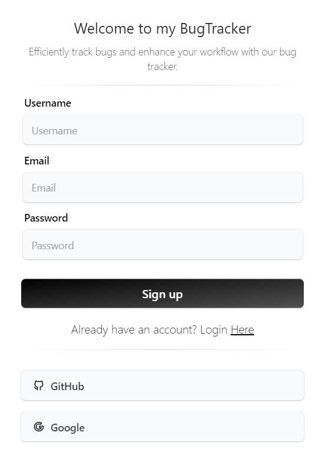
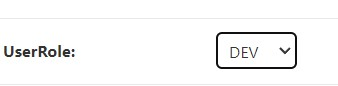
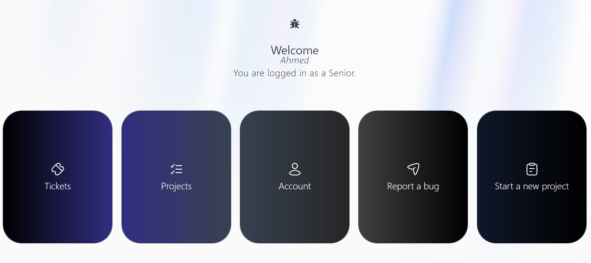
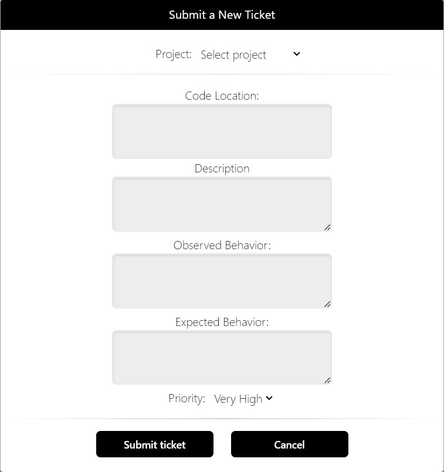
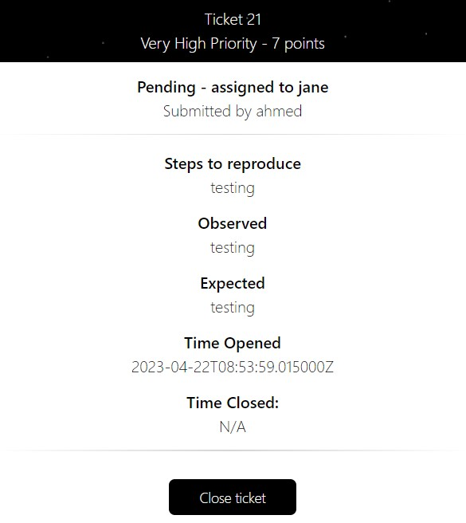
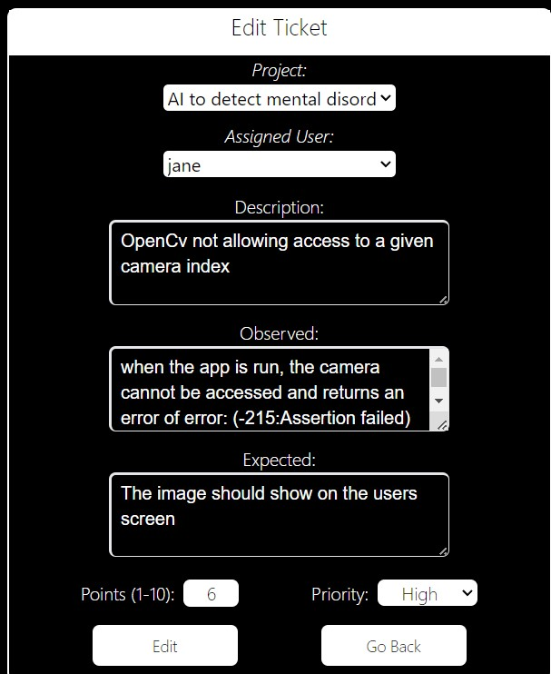
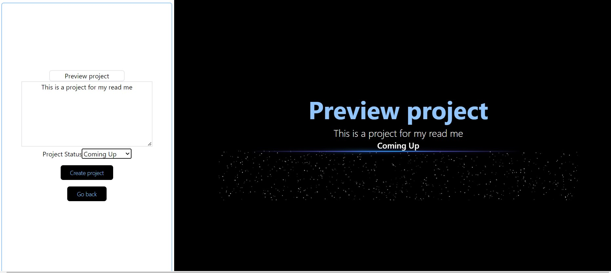
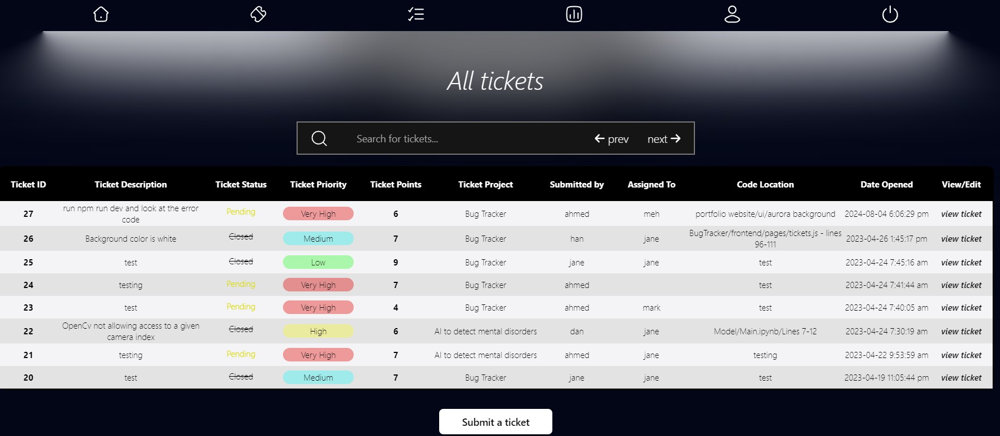
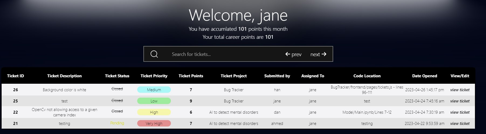

# Bug Tracker

Welcome to my bug tracker project! This tool is designed for bug tracking and can also be used as a ticketing system.

## Table of Contents
- [Overview](#overview)
- [Requirements](#requirements)
- [How to Install](#how-to-install)
- [Guide](#guide)
  - [Signup and Login](#signup-and-login)
  - [Registering a Senior/Admin](#registering-a-senioradmin)
  - [Homepage](#homepage)
  - [Tickets](#tickets)
    - [Creating a Ticket](#creating-a-ticket)
    - [Claiming & Closing a Ticket](#claiming--closing-a-ticket)
    - [Assigning Ticket Points, Users & Editing Tickets](#assigning-ticket-points-users--editing-tickets)
  - [Projects](#projects)
    - [Creating a New Project](#creating-a-new-project)
    - [Joining a Project](#joining-a-project)
    - [Editing Project Details](#editing-project-details)
    - [Removing Users from a Project](#removing-users-from-a-project)
  - [Main Page](#main-page)
  - [Account Page](#account-page)
- [Authentication](#authentication)
- [Technologies Used](#technologies-used)
  - [Languages](#languages)
  - [Frameworks Used](#frameworks-used)
  - [Database](#database)
  - [Other Technologies](#other-technologies)

---

## Overview

- User authentication and authorization
- 3 types of users: developers, seniors & admins
- Fully functional sign-up and login features
- User roles management
- Create and join projects
- Submit and track tickets
- Seniors and admins can assign/reassign tickets
- Seniors and admins can start new projects and add/remove users from projects
- Users can only view tickets for projects that they are assigned to

---

## Requirements

- Python
- Node.js

---

## How to Install

1. Clone this repository.
2. Create and run a virtual environment:
   - `python -m venv myenv`
   - `cd ./Scripts`
   - `activate.ps1`
3. Exit the environment and go to the root `/final-bugtracker`.
4. Install dependencies:
   - `pip install -r requirements.txt`
5. Start the backend:
   - `cd backend` 
   - `python manage.py runserver`
6. Open a new terminal for the frontend:
   - `cd frontend`
   - `npm install`
   - `npm run dev`

---

## Guide

### Signup and Login

To sign up, visit the signup page, enter your username, email, and password. The username will be used to log in. Default user role is **Developer**.

### Registering a Senior/Admin

Navigate to Django's admin portal (`http://localhost:8000/admin/`). Log in with:

1. Username: `admin`
2. Password: `admin`

You can now create a new user and assign them the **Senior/Admin** role.

---

## Homepage

Access all main pages here. **Seniors** and **Admins** can start new projects from the "Start a new project" tab.

---

## Tickets

### Creating a Ticket

To submit a ticket:

1. Go to the homepage and click "Submit a ticket".
2. Alternatively, click "Report a bug" upon login.

Fill in the form and submit. You can only view tickets for the projects you're assigned to.

### Claiming & Closing a Ticket

If a ticket is unassigned, any user can claim it. Only the assigned user can close it unless re-assigned by a **Senior**.

### Assigning Ticket Points, Users & Editing Tickets

**Seniors** and **Admins** can edit tickets, assign points, and reassign users.

---

## Projects

### Creating a New Project

**Seniors** and **Admins** can create new projects from the "Create a project" page.

### Joining a Project

Search and join projects via the "Projects" page. Each project lists the associated tickets.

### Editing Project Details

**Seniors** and **Admins** can modify project details and status.

### Removing Users from a Project

**Seniors** and **Admins** can remove users, after which they lose access to the project's tickets.

---

## Main Page

View all tickets assigned to you. You can also submit, search, and view tickets here.

---

## Account Page

Check your assigned tickets and points earned (monthly and cumulative) here.

---

## Authentication

**JWT tokens** are used for authentication, providing 3 hours of access per login session.

---

## Technologies Used

### Languages
- HTML
- CSS
- JavaScript
- TypeScript

### Frameworks Used
- Django (Rest API)
- Next.js

### Database
- MySQL

### Other Technologies
- JWT Tokens
- Tailwind CSS
