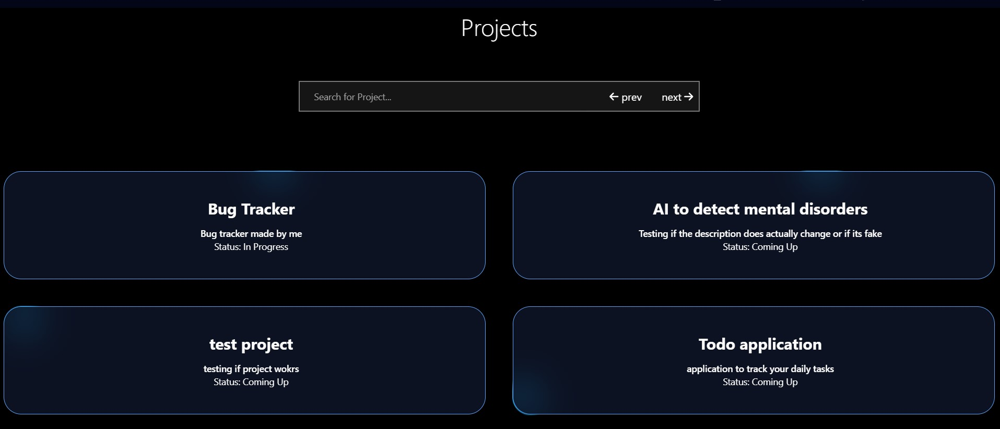

# BUG TRACKER

Welcome to my bugtracker project, this can be used for bug tracking but can also be used as a ticketing tool.

## Overview

- User authentication and authorization
- 3 types of users: developers, seniors & admins
- Fully functional sign up and login features
- User roles
- Create and join projects
- Submit and track tickets
- Seniors and admins can assign/reassign tickets
- Seniors and admins can start new projects and add/remove users from projects
- Users can only view tickets for projects that they are assigned to

### Requirements

- Python
- Node.js

### How to install

Clone this repository, create and run a virtual environment using:

1. `python -m venv myenv`
2. `cd ./Scripts`
3. `activate.ps1`
4. Exit the env file and go to root `/final-bugtracker`
5. Install requirements.txt
6. `pip install -r requirements.txt`
7. cd into the backend and run `python manage.py runserver`
8. Open a new terminal and cd into the frontend folder
9. Run `npm install` to install all the node packages
10. Run `npm run dev`

# Guide

## Signup and login

To sign up go into the signup page, enter your username, email & password, the username will be used to login. The default user will be a developer.

### To register a senior/admin

To register a senior/admin you will need to navigate to Django's default port (`http://localhost:8000/admin/`), and from there you can log in using:

1. username: admin
2. password: admin

From there you can create a new user and give it the senior/admin user role.

# Homepage

This is where you can access all the different pages. Seniors & admins have access to the "Start a new project" tab.

# Tickets

## Creating a ticket

To submit a ticket, you can:

1. Go to the homepage and click "Submit a ticket" there.
2. Click on "Report a bug" as soon as you log in.

Fill out the form and click submit. This will submit the ticket.

You can only submit and view tickets if you are part of that project.

## Claiming & Closing a ticket

If a ticket is open and there are no users assigned to that ticket, any user can claim that ticket. Once a ticket is assigned to a user, only they can close that ticket, unless a senior reassigns the user for that ticket.

When a user closes a ticket, they get the ticket points tallied to that month's points and their total points.

## Assigning ticket points, users & editing tickets

Anyone can submit a ticket. Seniors and admins have the ability to not only edit the ticket, but they can also assign points to the ticket and reassign the user handling the ticket.

# Projects

## Creating a new project

As a senior/admin, you have access to the "Create a project" page. This is where you can create a new project.

## Joining a project

If you want to join a project, you can navigate to the projects page (you can search for projects too), click on the project that you want to view, and from there you can click on the "Join project" button. Each project's page will contain the tickets assigned to that project.

## Editing project details

Seniors & admins can edit the project details and status.

## Removing users from a project

As a senior/admin, you have the right to remove users from a given project. Once a user is removed from a project, they can no longer view the tickets for that project.

# Main page

In the main page, you can view all the tickets for the projects that you are assigned to. From there, you can also submit and view tickets. You can also search for tickets.

# Account page

In the account page, you can view all the tickets that you are assigned to. You can also see how many points you've earned that month & how many points you've earned since you've joined.

# Authentication

JWT tokens are used to authenticate users. They allow users 3 hours of access.

# Technologies used

## Languages

- HTML
- CSS
- JavaScript
- TypeScript

## Frameworks used

- Django - Restful API
- Next.js

## Database

- MySQL

## Other technologies

- JWT tokens
- Tailwind CSS
